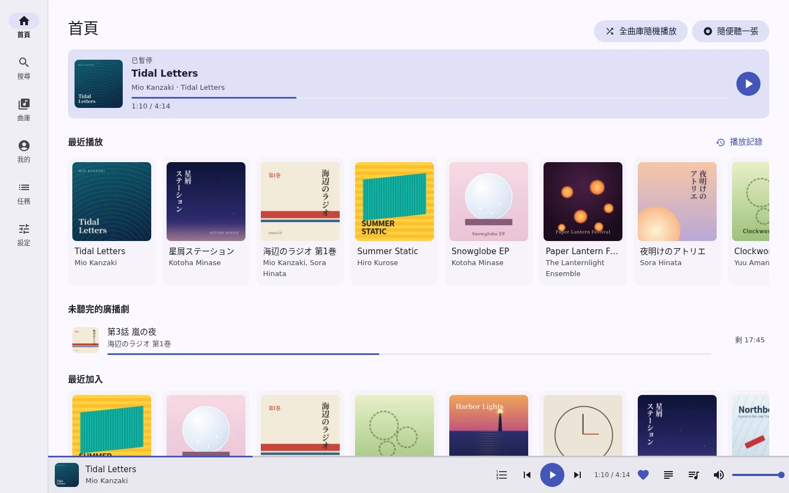
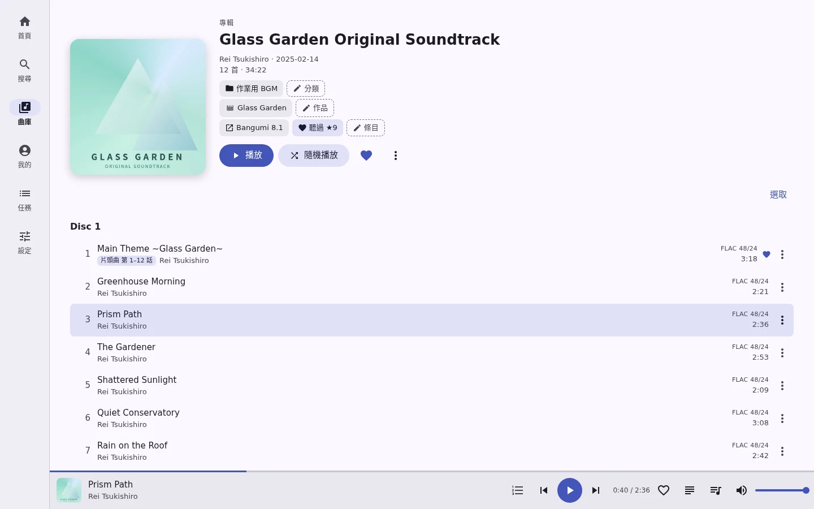
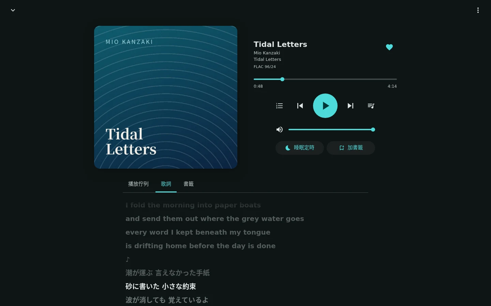
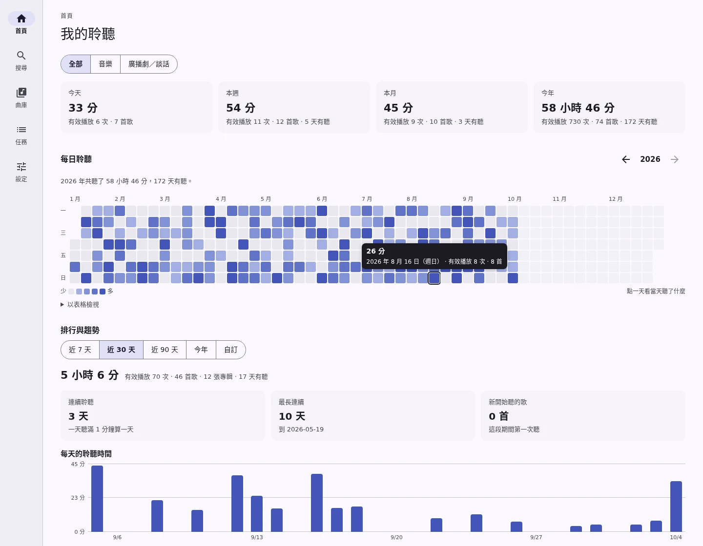
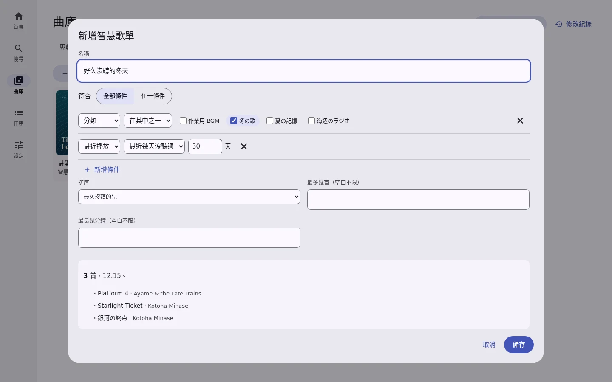
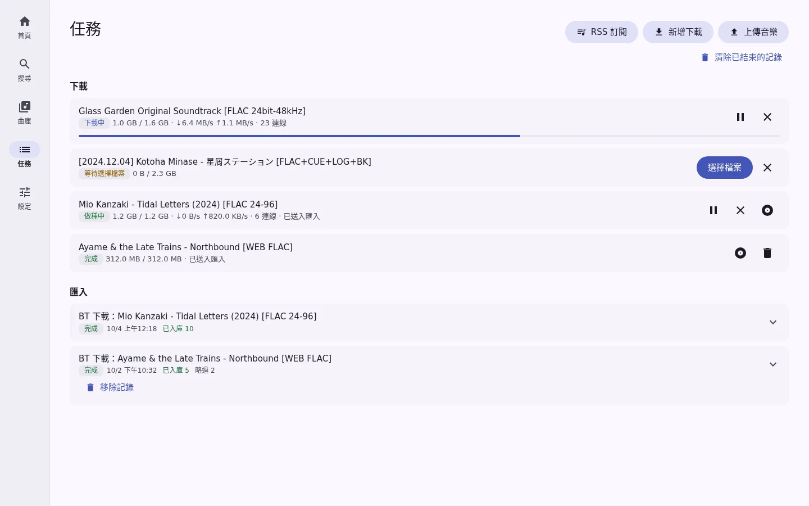
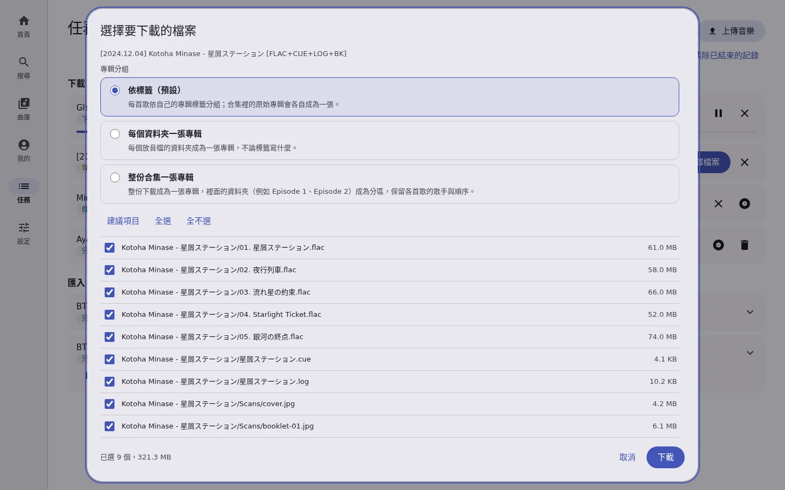
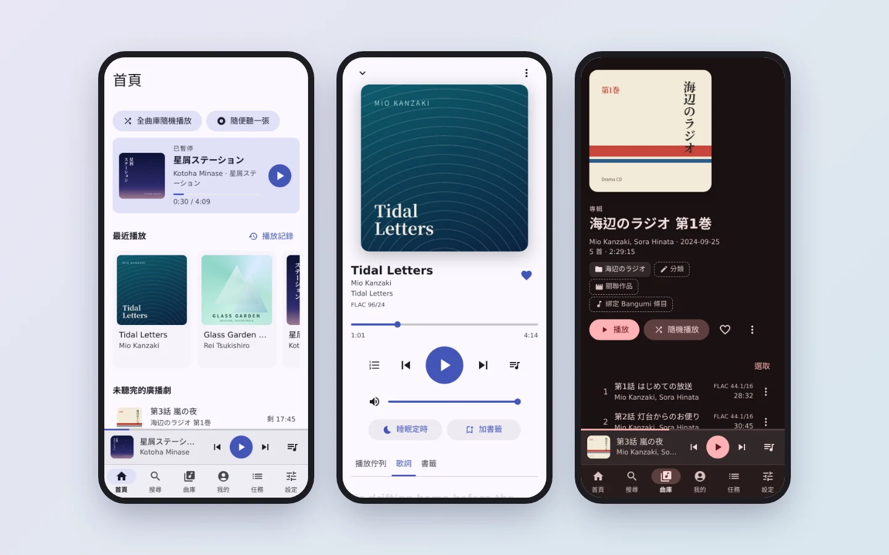

# Kanade（奏）

A private, self-hosted music library: find releases through BitTorrent, choose the files, download, tidy, store them in your own Google Drive, and play them from a browser on a computer or a phone (an Android app comes later). The interface is in Traditional Chinese.



## What it does

- **Get music**: magnet links, `.torrent` files and RSS feeds (with rules and automatic downloads) through aria2, and direct HTTP/HTTPS links to an audio file or a zip. You choose a torrent's files; a download larger than the server's staging space goes in batches, each imported and cleared before the next. Seeding stops by ratio or time.
- **Import and tidy**: reads tags (and guesses their text encoding), splits disc images by CUE sheet and converts other lossless formats to FLAC (FFmpeg), keeps CUE and log files with the album, treats a folder as an album where the tags do not say. It can turn a whole download into one album with a section for each folder. It also offers MusicBrainz lookups, details read from a pasted VGMdb page, editing one album or many at once, categories, links to the works albums belong to (anime, games, books, as [Bangumi](https://bgm.tv) describes them, with each song's part: opening, ending, insert song…), an album's own Bangumi entry with your Bangumi collection of it (status, rating, tags, comment) managed from the album once you link your Bangumi account, and a history where every change can be undone.
- **Store**: every file goes to your own Google Drive and is checked by SHA-256 after upload; files dropped into a Drive inbox folder are imported by themselves. The server keeps only a playback cache, so a small VPS is enough.
- **Play**: queue, shuffle, repeat, shuffling the whole library or carrying on with it, resuming dramas where they stopped, synced lyrics (from the files, LRC, or found on LRCLIB), bookmarks, a sleep timer, lock-screen controls, and what you play shown as your Discord status ("Listening to Kanade"), set by the server once you link your Discord account, with nothing to install on your computer or phone.
- **Collect**: favorites, playlists, smart playlists that pick by rules (category, artist, plays, last played…).
- **My listening**: time actually heard per day as a year's heat map, rankings and trends for any period, export as CSV or JSON.
- **Sign in** with a password or a passkey; a single Go binary sized for a 1.5 GB VPS.

| | |
|---|---|
|  |  |
|  |  |
|  |  |



The screenshots use a made-up demo library: the albums, artists, lyrics and covers were invented for it.

## Install

On a Linux server (amd64 or arm64), as root:

```bash
curl -fsSL https://raw.githubusercontent.com/HHim8826/kanade/main/scripts/kanade.sh -o kanade.sh && sudo bash kanade.sh
```

Where GitHub is slow (mainland China), put a proxy in front of the address, for example `https://ghproxy.net/https://raw.githubusercontent.com/…`; the script asks for the same proxy for its downloads.

What the script does:

- installs the release for the machine into `/opt/kanade` (data in `/opt/kanade/data`);
- runs it as a `kanade` system account under systemd, OpenRC or SysV init, and sets it to start at boot. Where there is none of these, as in a container, it runs in the background and starts at boot through cron `@reboot` when cron is there;
- installs aria2 and FFmpeg if you agree, from the system's packages. Where those have neither (RHEL and its relatives, Amazon Linux), it uses the static builds Kanade is developed with, in `/opt/kanade/tools`; FFmpeg's is a 150 MB download;
- creates an administrator with a random password and prints it.

Afterwards `sudo kanade-manager` opens the same menu:

| Command | |
|---|---|
| `kanade-manager install` / `update` / `uninstall` | Update checks the download against `SHA256SUMS`, backs up the database first, and goes back to the old version if the new one does not start. It also replaces `kanade-manager` itself with the release's script (checked the same way), even when Kanade is already up to date. Uninstall keeps the data unless you type `DELETE`. |
| `kanade-manager status` / `start` / `stop` / `restart` / `log [-f]` | Status also says whether Kanade starts at boot. |
| `kanade-manager autostart [on\|off]` | Start at boot or not (systemd, OpenRC, SysV or cron, whichever the machine uses); without an argument it shows the setting and asks. |
| `kanade-manager password` | Reset a password (random or your own); every login of that account ends. |
| `kanade-manager config` | Change the public address, the listen address, and the proxy in front (Cloudflare, or Nginx or Caddy on the machine): only the proxy named there is believed about a client's address, which the login throttle goes by. |
| `kanade-manager backup` / `restore` | Backups go to `data/backups/`; a restore saves the current database first. Once Drive is connected, the server also copies the database to Drive's `Kanade/backups` every day (the 14 latest are kept); to restore one, download it into `data/backups/` and run `restore`. Of the copies made before updates, the 5 latest are kept. |
| `kanade-manager tools` | Install aria2 and FFmpeg later, when they were skipped or the packages had none. |

Without questions (for automation): `sudo env KANADE_YES=1 KANADE_PUBLIC_URL=https://music.example.com KANADE_TRUSTED_PROXY=cloudflare bash kanade.sh install`; the header of `scripts/kanade.sh` lists the other settings, such as `KANADE_INIT=systemd|openrc|sysv|none`.

**Connecting Google Drive.** Kanade reaches Drive with your own OAuth client from Google Cloud; the settings page walks through creating it and shows the redirect URI to register. Google sends the browser back only to https domains (or localhost): behind a domain with https (Cloudflare Tunnel, Caddy, Nginx) it returns to Kanade by itself; reached by an IP address, Kanade registers `http://localhost/oauth/google/callback` and you paste the address the browser ends on. Passkeys need https in any case, and over plain http the password is sent unencrypted.

## Layout

| Path | What it is |
|---|---|
| `server/` | The Go service (`kanade`): API, importer, Drive storage, aria2 downloads, streaming cache, listening statistics, embedded web client |
| `server/internal/web/static/` | Browser client (Preact + htm, no build step), served at `/app/` |
| `server/scripts/upload-folder.py` | Command-line uploader, and the reference for how clients upload |
| `scripts/kanade.sh` | Install and manage script (`kanade-manager`) |
| `.github/workflows/ci.yml` | CI for pushes to main and pull requests: gofmt, vet, tests with the race detector (with aria2 and FFmpeg), the web client check (`server/scripts/check-web.mjs`), shellcheck and actionlint |
| `.github/workflows/release.yml` | Runs CI, then builds and publishes a release for each version tag |
| `docs/` | Plan, decisions (D1–D11, these override the plan), backend design with the API and an implementation record, P0 validation results, library survey; `docs/images/` holds the screenshots above |

## Build and run

Requires Go 1.27+. Pure Go (no cgo), so it cross-compiles for linux/amd64 and linux/arm64.

```bash
cd server
go test ./...
go build -o bin/kanade ./cmd/kanade

export KANADE_DATA=/path/to/data          # database, settings, staging, cache; created with mode 0700
./bin/kanade config set public_url https://music.example.com
./bin/kanade config set listen 127.0.0.1:8080
printf '%s\n' 'a long password' | ./bin/kanade user add admin
./bin/kanade serve
```

Settings live in the data directory's `config.json` (`kanade config` shows them); the flags of `serve` (`-listen`, `-public-url`, `-aria2`) override them for one run. Settings that the web page changes (cache and staging sizes, download limits, seeding, Drive sync) are kept in the database and take effect at once. `kanade backup FILE` copies the database while the service runs.

`serve` looks for `aria2c` next to the binary, at `$KANADE_ARIA2` (or the `aria2` setting), in `tools/aria2/` of the checkout the binary or the working directory is in, and on `PATH`; without it the server runs with downloads off. FFmpeg (`$KANADE_FFMPEG`, `tools/ffmpeg/bin/` beside the data directory, or `PATH`, with `ffprobe` next to it) converts lossless formats to FLAC and splits disc images by their CUE sheets; without it those files wait.

## Releases

Push a version tag and GitHub Actions runs CI, then builds and publishes the release the install script downloads (`kanade-linux-amd64.tar.gz`, `kanade-linux-arm64.tar.gz`, `SHA256SUMS` covering them and `kanade.sh`, `VERSION`, `kanade.sh`):

```bash
git tag v0.1.0 && git push origin v0.1.0
```

A tag with a hyphen (`v0.2.0-rc1`) is published as a pre-release, which `latest` skips. Running the workflow by hand builds the same files as an artifact without releasing them. CI must pass on the tagged commit, gofmt included, or nothing is released.

## License

[AGPL-3.0](LICENSE). If you run a modified Kanade for other people, offer them its source. The bundled Preact and htm keep their own licenses (`server/internal/web/static/vendor/`).

## Design notes

Start with `docs/decisions.md` and `docs/backend-design.md`. In short: Drive is accessed directly through its REST API (D1); every file is verified by SHA-256 after upload; playback downloads the whole track into a local cache in the background, because each Drive request costs about 0.6 s (D7); everything is sized for a 1.5 GB RAM VPS. Listening statistics count time actually heard, cut into 15-minute spans so any time zone's days add up.
